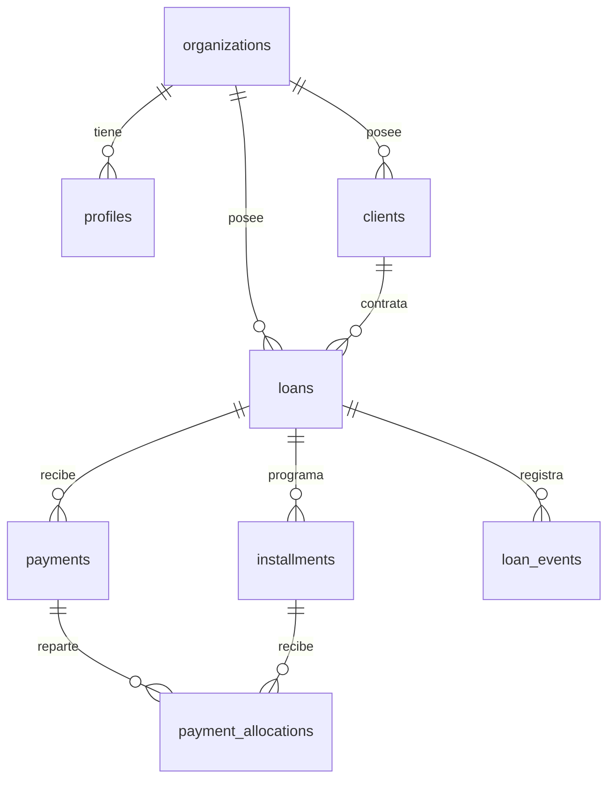

# Documento constitutivo del sistema de gestión de préstamos

| Campo | Valor |
|--------|--------|
| **Versión** | 1.4 |
| **Fecha** | 22 de abril de 2026 |
| **Estado** | Vigente hasta revisión explícita |

---

## 1. Identidad y propósito

### 1.1 Denominación provisional

**Sistema de gestión automatizada de préstamos multiplataforma** (nombre comercial definitivo sujeto a decisión posterior).

### 1.2 Declaración de propósito

El sistema existe para **administrar préstamos entre la organización prestamista y múltiples clientes**, reduciendo trabajo manual repetitivo mediante **cálculo automático de planes de pago**, **seguimiento de estados** y **registro auditable de operaciones**, accesible de forma coherente desde **web**, **Android** e **iOS**.

### 1.3 Misión

Ofrecer una herramienta **confiable, clara y trazable** para el ciclo de vida del préstamo: desde el alta del cliente y el desembolso hasta el cierre por pago total, con visibilidad del cumplimiento y la mora.

---

## 2. Principios rectores (no negociables)

1. **Una sola verdad de datos**: montos, cuotas, saldos y pagos se derivan de reglas explícitas persistidas; no se aceptan “ajustes manuales” sin dejar rastro.
2. **Seguridad y mínimo privilegio**: acceso autenticado; datos particulados por organización/usuario según el modelo de despliegue; comunicación cifrada (HTTPS).
3. **Transparencia hacia el operador**: toda acción relevante sobre préstamos y pagos debe poder **explicarse** desde el historial y el estado del préstamo.
4. **Respeto al marco legal y ético**: el software es un **instrumento de gestión**; la licitud de tasas, contratos, cobranza y tratamiento de datos personales es **responsabilidad de la organización usuaria** y debe documentarse fuera de este código.
5. **Mantenibilidad**: priorizar arquitectura **web moderna + Capacitor** para móviles, con lógica de negocio **testeable** (especialmente cálculo de cuotas y aplicación de pagos).

---

## 3. Alcance funcional constitutivo

### 3.1 Dentro de alcance (MVP constitutivo)

- **Clientes**: alta, consulta y edición de datos básicos de contacto e identificación según diseño posterior.
- **Vista por cliente**: resumen operativo del cliente, listado de sus préstamos y de los pagos asociados a esos préstamos.
- **Préstamos**: creación con parámetros acordados (capital, tasa, plazo, frecuencia, fecha de inicio/desembolso).
- **Estimación precontractual**: cálculo orientativo del plan de cuotas **antes** de formalizar el préstamo, incluyendo **totales por columna** (capital, interés, cuota) coherentes con la tabla estimada.
- **Plan de cuotas**: generación **automática** al formalizar el préstamo.
- **Pagos**: registro de pagos y su **imputación** a cuotas según reglas definidas (p. ej. prioridad por vencimiento); alta de pagos desde el detalle del préstamo y desde el **listado global de pagos** sobre préstamos **activos**.
- **Estados**: derivación automática de situación de cuotas y del préstamo (al día, vencido, cerrado).
- **Configuración de organización**: nombre comercial o razón social en interfaz, **logo** (identidad visual), **moneda ISO** de referencia para importes en la aplicación y **tasa anual predeterminada** para nuevos préstamos (valores por defecto editables).
- **Interfaz unificada**: misma aplicación en navegador y empaquetada para **Android** e **iOS** (la empaquetación móvil constituye fase posterior; ver **Anexo C**).

### 3.2 Fuera de alcance inicial (salvo enmienda explícita)

- Motor de **scoring** crediticio o integración bancaria obligatoria.
- **Cobranza judicial** o automatización de acciones legales.
- Garantías físicas complejas (gravámenes) sin modelo de datos acordado.
- **Cartera simultánea en varias monedas de referencia** (distintas monedas ISO en convivencia sin reglas de conversión ni cierre por divisa) y productos exóticos sin especificación previa. *Queda excluido; no obstante, una única moneda ISO configurable por organización para toda la UI y los cálculos del MVP web sí está dentro del alcance (véase §3.1 y Anexo C).*

---

## 4. Marco técnico constitutivo

De acuerdo con las decisiones de diseño adoptadas:

| Dimensión | Decisión constitutiva |
|-----------|------------------------|
| **Plataformas** | Web, Android, iOS (no se exige en esta versión app de escritorio macOS nativa). |
| **Paradigma de cliente** | Aplicación **web moderna** empaquetada con **Capacitor** para tiendas móviles. |
| **Lenguaje / UI** | **TypeScript** y **React** (proyecto inicializado con **Vite**; enrutamiento con **React Router** en modo navegador para el MVP web). |
| **Datos** | **Postgres** como fuente de verdad **en producción**; autenticación y políticas de acceso acordes al proveedor elegido (p. ej. Supabase con RLS) o API propia equivalente. *La implementación actual de laboratorio/MVP persiste en el cliente; ver **Anexo C**.* |
| **Automatización** | Procesos por lotes o funciones programadas para **mora y estados**; notificaciones push como **extensión** posterior cuando existan credenciales y política de uso. |

Cualquier cambio sustancial a esta tabla (p. ej. sustituir Capacitor por otra pila móvil) constituye **enmienda al documento constitutivo**.

---

## 5. Actores y responsabilidades

| Actor | Rol frente al sistema |
|--------|------------------------|
| **Titular del producto** | Prioriza alcance, acepta entregables y asume trade-offs de negocio. |
| **Operador / prestamista** | Crea y mantiene clientes, préstamos y pagos; usa reportes operativos. |
| **Cliente final** | Sujeto de datos y, si se habilita, usuario de consulta o autopago (solo si el roadmap lo incorpora). |
| **Mantenimiento técnico** | Despliegue, copias de seguridad, rotación de secretos y parches de seguridad. |

Los roles concretos pueden coincidir en una misma persona en despliegues pequeños; el documento define **funciones**, no cargos laborales.

---

## 6. Datos personales y cumplimiento

- El sistema tratará **datos personales y financieros sensibles**: su tratamiento debe alinearse con la normativa aplicable (por ejemplo RGPD en UE, leyes locales de protección de datos y hábitos sectoriales).
- Se exige **minimización**: recolectar solo campos necesarios para operar el préstamo.
- Se exige **capacidad de exportación y borrado** acorde a la política de retención que defina la organización (detalle operativo en fase de diseño legal/operativo).

---

## 7. Gobernanza y enmiendas

1. Este documento es la **referencia normativa interna** para conflicto entre “rápido” y “alineado con el producto”.
2. Toda **enmienda** debe: incrementar versión (p. ej. 1.0 → 1.1), fecha y breve motivo al final de este archivo.
3. Cambios que solo afectan implementación sin alterar principios o alcance constitutivo **no** requieren enmienda; bastará control de versiones del código y documentación técnica adjunta.

---

## Anexo A — Especificación mínima para la construcción

El constitutivo fija **propósito, límites y principios**. Para iniciar o continuar la **implementación** sin retrabajo costoso, el titular del producto (o su delegado) debe **cerrar o delegar por escrito** los siguientes bloques. Pueden vivir en documentos separados (`docs/PRD-MVP.md`, `docs/MOTOR-PRESTAMOS.md`, etc.) siempre que **no contradigan** este constitutivo.

### A.1 Motor financiero y reglas de negocio

- **Modalidad de amortización** acordada (p. ej. francés, alemán, cuota fija de capital, interés simple u otra) y referencia o pseudocódigo aceptado.
- **Tipo de tasa** (nominal / efectiva), **periodicidad** de capitalización o de pago y **convención de conteo de días** (p. ej. 30/360, act/360).
- **Redondeo**: decimales en interés, cuota y saldo; tratamiento del **residuo** final.
- **Moneda** (una para el MVP salvo enmienda) y **zona horaria** oficial para vencimientos y cierres diarios.
- **Pagos parciales**: orden de imputación (p. ej. intereses moratorios → interés corriente → capital) y reglas de **reprogramación** si las hay.
- **Mora**: existencia o no de **días de gracia**, **interés moratorio**, **comisiones** o **penalidades**; cálculo y redondeo asociados.
- **Estados** concretos de **préstamo** y de **cuota**, y **transiciones** válidas entre ellos.

### A.2 Modelo de datos, identidad y permisos

- Inventario de **entidades** y **atributos** obligatorios u opcionales (cliente, préstamo, cuota, pago, documentos adjuntos si aplican). El **modelo relacional de referencia** (tablas y vistas constitutivas) figura en el **Anexo B**.
- Modelo de **multiusuario**: un solo operador, varios operadores de una misma organización, o **multi-tenant** (varias organizaciones aisladas).
- **Roles** (p. ej. administrador, operador, solo lectura) y matriz **quién puede qué**.
- Política de **auditoría**: eventos mínimos a registrar (creación/edición/borrado lógico, registro de pago, cambios de estado).

### A.3 Arquitectura técnica operativa

- Elección **cerrada** del backend de datos y auth (p. ej. Supabase con RLS **o** API propia sobre Postgres) y entornos (**desarrollo / preproducción / producción**).
- Estrategia de **despliegue** del front web, **CI/CD** y **migraciones** de esquema versionadas.
- Contrato de integración: **API REST/GraphQL** o acceso directo vía SDK, y convenciones de **errores** y **versionado**.

### A.4 Producto y experiencia de usuario (MVP)

- **Mapa de navegación** y listado de **pantallas** incluidas en el primer entregable.
- **Flujos críticos** descritos (crear préstamo, generar plan, registrar pago, listar morosos o equivalentes).
- **Criterios de aceptación** verificables por historia de usuario (formato “dado / cuando / entonces” u homologable).

### A.5 Requisitos no funcionales

- Necesidad de **uso sin conexión** en móvil frente a **solo online**.
- **Idioma(s)** de la interfaz en el MVP.
- Expectativas de **rendimiento**, **disponibilidad** y, si aplica, **accesibilidad** (nivel mínimo acordado).

### A.6 Operación, cumplimiento y puesta en servicio

- **Jurisdicción** aplicable y responsable de **bases legales** del tratamiento de datos.
- **Plazos de retención** y procedimiento de **exportación / supresión** alineado con la política interna.
- Plan mínimo de **copias de seguridad**, **restauración** y **rotación de secretos**.

Los ítems del Anexo A **no sustituyen** la documentación detallada; constituyen la **lista constitutiva de cierres** que habilitan la construcción alineada con el alcance del §3 y el marco del §4. El **estado de implementación** del software en el repositorio se describe en el **Anexo C**.

---

## Anexo B — Estructura de datos constitutiva (Postgres)

Objetivo: fijar el **núcleo relacional** y las **vistas de lectura** alineados con el §3 (clientes, préstamos, cuotas, pagos, estados, trazabilidad). Los **tipos SQL**, **constraints** y **políticas RLS** se documentan en migraciones y, si aplica, en `docs/MODELO-DATOS.md`. Sustituir o eliminar tablas de este anexo constituye **enmienda** del constitutivo.

### B.1 Tablas del núcleo

| Tabla | Función constitutiva |
|--------|----------------------|
| **`organizations`** | Una fila por prestamista u organización; ancla multi-tenant y configuración global opcional. |
| **`profiles`** | Perfil de aplicación ligado a `auth.users` (nombre para mostrar, etc.). |
| **`organization_members`** | Relación **usuario ↔ organización** con **`role_id`** hacia un rol **definido por la organización** (RBAC). |
| **`roles`** | Rol con nombre y descripción propios de la org; `is_system` puede proteger el rol *Propietario*. |
| **`permissions`** | Catálogo global de códigos de permiso atómicos (véase [`docs/PERMISSIONS.md`](PERMISSIONS.md)). |
| **`role_permissions`** | Asignación N:M entre roles y permisos. |
| **`clients`** | Deudor: datos de contacto e identificación; siempre ligado a una `organization_id`. |
| **`loans`** | Cabecera del préstamo: vínculo a cliente, capital, tasa y parámetros acordados en el **Anexo A.1**, fechas, moneda, **estado del préstamo**. |
| **`loan_events`** (opcional, recomendada) | Eventos de negocio: cambios de estado, reprogramaciones, notas del motor; soporta el principio de **transparencia** del §2. |
| **`installments`** | Plan de cuotas: vencimiento, montos programados (capital / interés / total según diseño), **estado de cuota**, vínculo a `loans`. |
| **`payments`** | Cobro registrado: fecha efectiva, monto total, método, nota; las **imputaciones** pueden modelarse como tabla `payment_allocations` o como **JSON** (`allocations`) en la fila de pago en implementaciones ligeras. |
| **`payment_allocations`** | (Opcional si no se usa JSON en `payments`.) Reparto de un pago sobre cuotas. |
| **`loan_penalties`** o columnas en `installments` | Mora y cargos adicionales **solo** si el titular del producto los define en A.1; si no existen reglas, no se materializa esta pieza en el MVP. |
| **`audit_logs`** | Auditoría genérica (actor, entidad, id, acción, payload antes/después, marca temporal) u mecanismo equivalente con el mismo efecto constitutivo. |

**Índices de referencia** (obligatoriedad técnica, no normativa del negocio): `organization_id` en tablas multi-tenant; `loan_id` en cuotas y pagos; `client_id` en préstamos; `due_date` (o nombre homólogo) en cuotas para jobs de mora y vistas de vencimiento.

**Despliegues mínimos**: si el MVP opera con **un solo operador** sin multi-tenant explícito, se permite una única fila en `organizations` y políticas simplificadas, **sin contradecir** la posibilidad de evolución posterior.

### B.2 Vistas de lectura e informes

Las vistas **no sustituyen** las tablas; centralizan consultas y permisos de solo lectura. Con **RLS** (p. ej. Supabase), las vistas deben comportarse de forma segura respecto al tenant; en Postgres reciente puede valorarse `security_invoker` u otra estrategia acordada en implementación.

| Vista | Propósito constitutivo |
|--------|------------------------|
| **`v_installments_due_soon`** | Cuotas pendientes o parcialmente pagadas con vencimiento en ventana configurable (p. ej. próximos 7 días). |
| **`v_overdue_installments`** | Cuotas vencidas no saldadas; expone días de atraso, montos pendientes y datos de cliente/préstamo para gestión de cobro. |
| **`v_loan_balance_summary`** | Por préstamo: totales pagados, saldo vivo, próxima cuota y estado agregado; base de listados y tablero operativo. |
| **`v_client_exposure`** | Por cliente: préstamos activos, exposición consolidada y peor estado de mora. |
| **`v_payment_ledger`** (opcional) | Libro legible: pagos unidos a imputaciones y cuotas, apto para UI y exportación. |

### B.3 Relación lógica entre entidades

---

## Anexo C — Estado de implementación del software (MVP web)

Este anexo **no sustituye** el modelo objetivo del **Anexo B** ni los cierres del **Anexo A**; describe la **línea base de código** existente en el repositorio para alinear expectativas entre constitutivo y producto entregable **hoy** en navegador.

### C.1 Alcance ya cubierto en el cliente web

| Área | Comportamiento implementado |
|------|------------------------------|
| **Stack** | React 18, TypeScript, Vite, React Router (**BrowserRouter**), CSS propio (sin Capacitor en esta rama). |
| **Landing y auth** | Ruta pública `/`, login `/login`, registro `/register`; zona de app bajo `/app/*` con sesión Supabase cuando existen variables de entorno (véase `docs/SUPABASE.md`). |
| **RBAC** | Roles personalizados por organización y catálogo de permisos; UI bajo `/app/equipo` cuando el usuario tiene permisos correspondientes. |
| **Persistencia** | Con Supabase configurado: datos en **Postgres** con RLS. Sin variables de entorno: datos en **`localStorage`** (modo demo local). |
| **Motor de cuotas** | **Sistema francés** (cuota fija); tasa anual nominal repartida por frecuencia (mensual / quincenal / semanal); redondeo a dos decimales en implementación. |
| **Estimación** | En **Nuevo préstamo**, tabla de cuotas estimada **antes** de crear el préstamo, con fila **Totales** (suma capital, suma intereses, suma cuota). |
| **Pagos** | Imputación **interés corriente primero, luego capital** sobre cuotas por orden de vencimiento; pantalla **Pagos** con historial y **alta de pago** eligiendo cliente y **préstamo activo**. |
| **Clientes** | Listado, alta, eliminación si sin préstamos; **ficha de cliente** con panel resumido, préstamos del cliente y pagos agregados. |
| **Organización** | Pantalla **Configuración**: nombre, logo (data URL), moneda ISO (formato e importes vía `Intl` / `es-ES`), tasa anual predeterminada. |
| **Formato numérico** | Presentación y edición alineadas con **es-ES**: miles con **punto** y decimales con **coma** en campos e importes monetarios según moneda configurada. |

### C.2 Desalineaciones conocidas respecto al constitutivo “objetivo”

| Tema | Estado |
|------|--------|
| **Postgres / RLS / multiusuario** | Implementado vía **Supabase** cuando el proyecto está configurado; en caso contrario persiste el modo **solo local** en el navegador. |
| **Android / iOS (Capacitor)** | Pendiente de empaquetado y publicación en tiendas. |
| **Anexo A.1** | Cierres formales (convención de días, mora financiera explícita, auditoría persistente tipo `audit_logs`) **parcialmente** cubiertos por la lógica actual; documentación de motor en código y README del repo. |
| **Vistas SQL del Anexo B** | No aplicables hasta existir base de datos servidor; la UI reproduce consultas equivalentes en memoria. |

### C.3 Próxima sincronización constitutiva recomendada

Al conectar **Postgres** (o servicio gestionado), migrar el modelo lógico del cliente al **Anexo B**, introducir **autenticación** y políticas de acceso, y **revisar** el §3 y el §4 para reflejar entornos y despliegue real; esa migración debería conllevar incremento de versión del presente documento.

---

## 8. Firma y vigencia

Este documento entra en vigor con su **publicación en el repositorio** bajo `docs/DOCUMENTO-CONSTITUTIVO.md` y sustituye a acuerdos informales previos sobre el mismo objeto.

**Titular del producto (nombre y firma):** _____________________________  
**Fecha de aceptación:** _____________________________

---

## Historial de versiones

| Versión | Fecha | Resumen |
|---------|--------|---------|
| 1.4 | 2026-04-22 | Anexo B: modelo RBAC (`roles`, `permissions`, `role_permissions`, `organization_members`); `docs/PERMISSIONS.md`; Anexo C actualizado (landing, auth Supabase, RBAC). |
| 1.3 | 2026-04-22 | §3.1 ampliado (cliente, estimación con totales, pagos globales, configuración org.); §3.2 matizado (moneda única por org); §4 nota MVP; **Anexo C**: estado de implementación web (`localStorage`, motor francés, Capacitor/Postgres pendientes). |
| 1.2 | 2026-04-21 | Anexo B: estructura de datos constitutiva (tablas núcleo, vistas, índices de referencia, diagrama ER). Referencia cruzada en A.2. |
| 1.1 | 2026-04-21 | Anexo A: especificación mínima para construcción (cierres de negocio, datos, técnica, UX, NFR y operación). |
| 1.0 | 2026-04-21 | Versión inicial constitutiva. |
